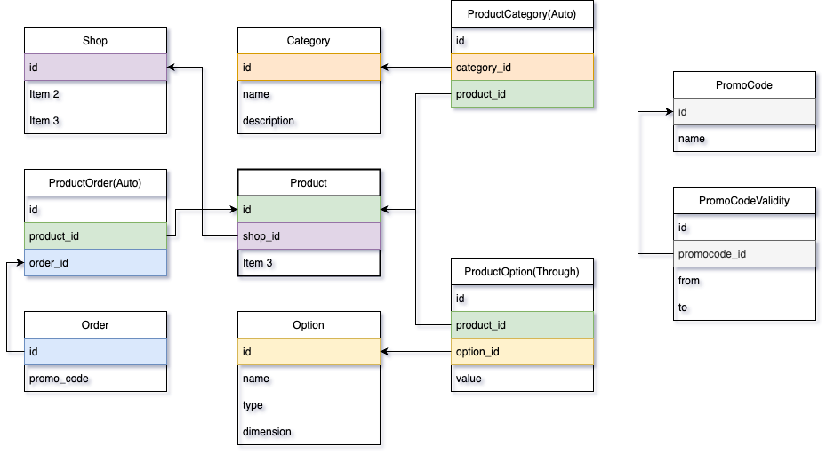

## How to run

- docker-compose up -d - Для запуска postgres.
- python3 -m venv venv - для создания нового виртуального окружения.
- pip install -r requirements.txt - установка зависимостей.
- make migrate - применить миграции.
- make init_db - залить тестовые данные в БД.

P.S: Для корректной работы в Pycharm рекомендую промаркировать папку advanced_orm как "Sources Root"

## Makefile

    migrations:
        python ./advanced_orm/manage.py makemigrations
    
    migrate:
        python ./advanced_orm/manage.py migrate
    
    drop_migrations:
        python ./advanced_orm/manage.py migrate shop zero
    
    init_db:
        python ./advanced_orm/manage.py init_demo_db
    
    clean_db:
        python ./advanced_orm/manage.py clean_up_demo_db
    
    refill_db: clean_db init_db

## Полезные ссылки

### PostgreSQL specific model fields

  - https://docs.djangoproject.com/en/4.1/ref/contrib/postgres/fields/ - Особо рекомендую обратить внимание на ArrayField
  - https://docs.djangoproject.com/en/3.1/topics/db/queries/#querying-jsonfield - JSON Field

### Шардирование баз данных

  - https://docs.djangoproject.com/en/4.1/topics/db/multi-db/
  - https://github.com/mrts/docker-postgresql-multiple-databases

### Model Factories

  - https://factoryboy.readthedocs.io/en/stable/ 

### Built-in database functions list.

  - https://docs.djangoproject.com/en/4.1/ref/models/database-functions/

## Схема базы данных

